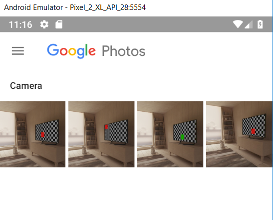

# nativescript-receiving-shared-content

## iOS

The iOS implementation is entirely outside the built NativeScript app. Follow [this link](https://www.technetexperts.com/mobile/share-extension-in-ios-application-overview-with-example/) for step-by-step instructions. Structured NativeScript instructions [here](https://github.com/NickIliev/NS-Issues-2018-II/tree/master/test/share-extension).

> **Important**: You will need an AppID with provisioning profile that has `App Groups` enabled!

> **Note**: Once NativeScript supports [App Extensions](https://github.com/NativeScript/nativescript-cli/issues/3965) there will be an update with the source need ot enable the Share extension via NativeScript.

## Android

POC for implementing https://developer.android.com/training/sharing/receive#java

With the above your application will be listed in the share action intent on Android and users can load and shre different media types **to** your applicaiton

- Add intent filters for `AndoridManifest.xml`

```XML
<activity android:name="com.tns.NativeScriptActivity"
          android:label="@string/title_activity_kimera"
          android:configChanges="keyboardHidden|orientation|screenSize"
          android:theme="@style/LaunchScreenTheme">
    <meta-data android:name="SET_THEME_ON_LAUNCH" android:resource="@style/AppTheme" />

    <intent-filter>
        <action android:name="android.intent.action.SEND" />
        <category android:name="android.intent.category.DEFAULT" />
        <data android:mimeType="image/*" />
    </intent-filter>
    <intent-filter>
        <action android:name="android.intent.action.SEND" />
        <category android:name="android.intent.category.DEFAULT" />
        <data android:mimeType="text/plain" />
    </intent-filter>
    <intent-filter>
        <action android:name="android.intent.action.SEND_MULTIPLE" />
        <category android:name="android.intent.category.DEFAULT" />
        <data android:mimeType="image/*" />
    </intent-filter>
</activity>
```

- Overwrite the activity onCreate method (or extend the activity)

```TypeScript
application.android.on(application.AndroidApplication.activityCreatedEvent, function (args) {
    let activity = args.activity;
    // Get intent, action and MIME type
    let intent = activity.getIntent();
    let action = intent.getAction();
    let type = intent.getType();

    if (android.content.Intent.ACTION_SEND === action && type != null) {
        if (type.startsWith("text/")) {
            handleSendText(intent); // custom method to handle text being sent
        } else if (type.startsWith("image/")) {
            handleSendImage(intent); // custom method to handle single image being sent
        }
    } else if (android.content.Intent.ACTION_SEND_MULTIPLE === action && type != null) {
        if (type.startsWith("image/")) {
            handleSendMultipleImages(intent); // custom method to handle multiple images being sent
        }
    } else {
        // Handle other intents, such as being started from the home screen
    }
});
```


As a result you can now receive shared content from other apps to your NativeScript application.




